# TMI_Project
누구나 재능을 판매할 수 있고, 구매할 수 있는 여러 카테고리의 다양한 재능들을 상품으로서 판매, 거래, 공유를 할 수 있는 사이트입니다.
 
 
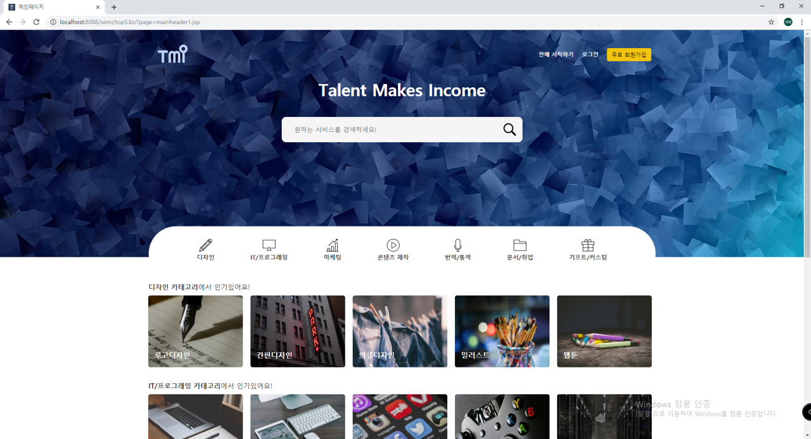
## Overview

## Skills

## 회원 관련 기능
### 회원가입
회원가입시 해야하는 기본적인 유효성검사를 하였습니다.
* 이메일, 이름, 비밀번호, 비밀번호 확인, 주민등록번호, 닉네임, 핸드폰번호를 입력받고 해당 데이터가 입력되지 않았을 경우 해당 태그에 포커싱되게 하고 회원가입이 되지 않게 하였습니다.
* 이메일은 ex) test@gmail.com 처럼 @ 앞에 아이디 뒤에 메일주소를 입력하지 않으면 회원가입이 되지 않도록 하였습니다.
* 회원정보 등록시 DB에서 이메일의 중복 여부를 체크하여 중복되어있을 경우 중복된 이메일이라는 경고창과 함께 회원가입이 되지 않도록 하였습니다.
* 이름은 2~10글자 이내로 한글 및 영문만 입력하게 하였습니다.
* 비밀번호와 비밀번호 확인은 영문+숫자+특수문자 조합으로 8~16이내의 정보를 입력하지 않거나 둘의 값이 다를 경우 회원가입이 되지 않도록 하였습니다.
  
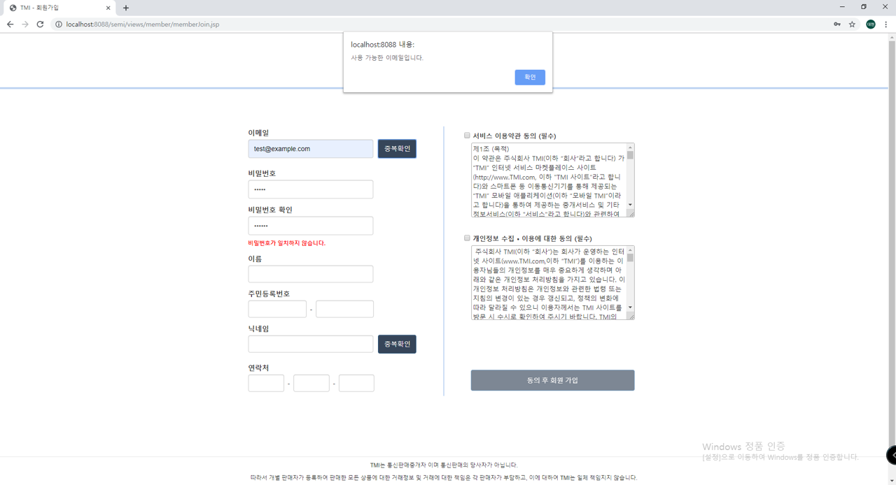
### 로그인
이메일과 비밀번호 조회결과를 체크합니다.
* 아이디, 비밀번호를 입력하였는지 공백여부를 체크합니다.
* 로그인 정보가 db정보와 일치하지 않는다면 아이디가 틀렸는지 비밀번호가 틀렸는지의 경우를 따로 알려줍니다.
* 로그인을 하지 않을경우 로그인 페이지와 회원가입 페이지 이외의 서비스를 이용할 수 없게 하였습니다.
  

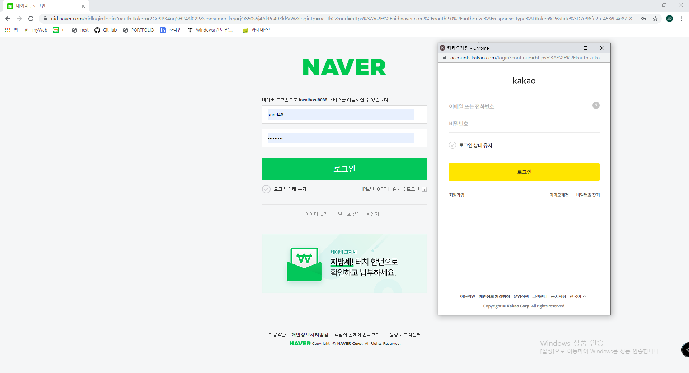
### ID / PWD 찾기

### 1:1 문의 작성

* * *
## 서비스 구매
### 서비스 검색 기능

### 서비스 카테고리 별 조회
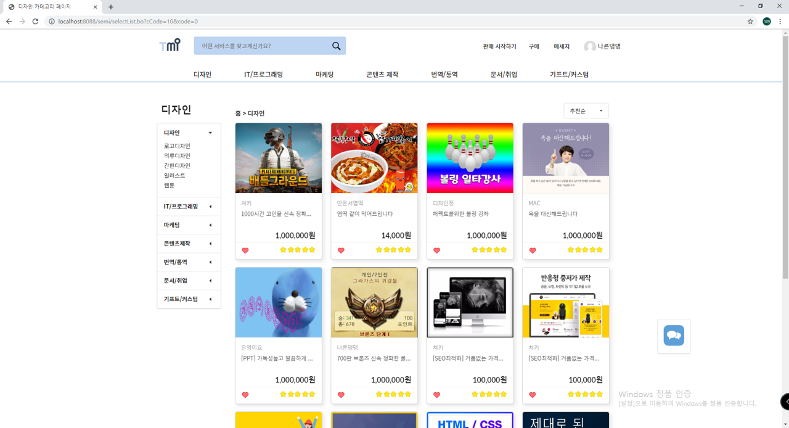
### 결제

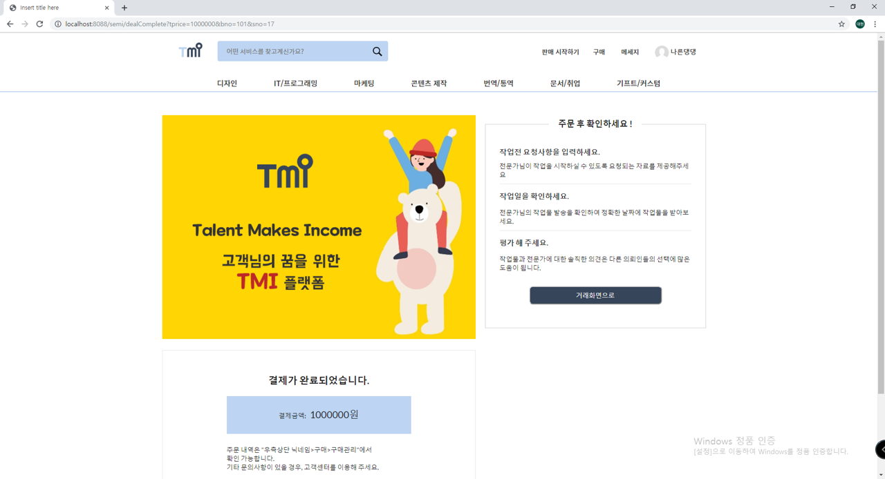
### 구매 관리
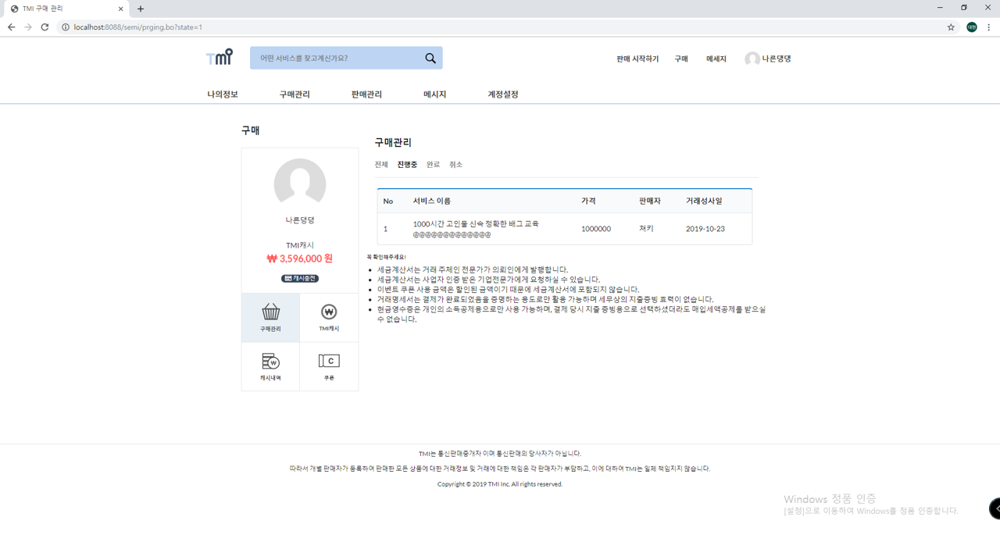
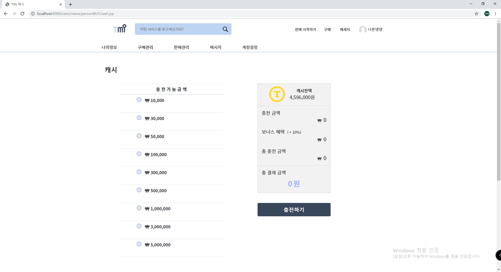
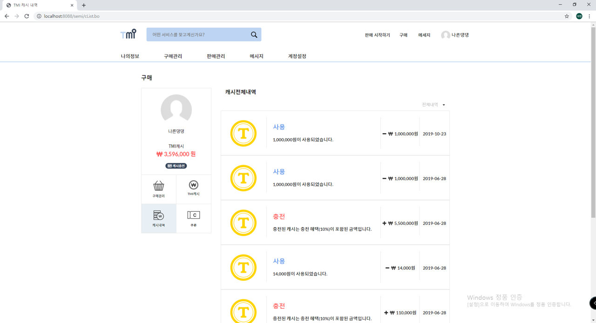
* * *
## 서비스 판매
### 서비스 등록 신청
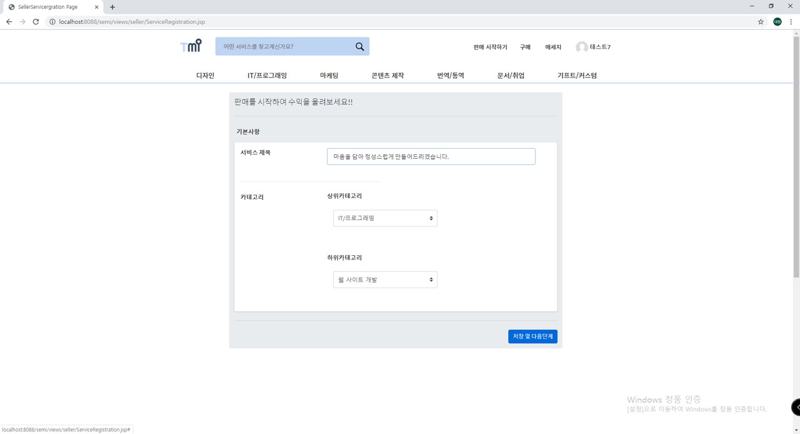

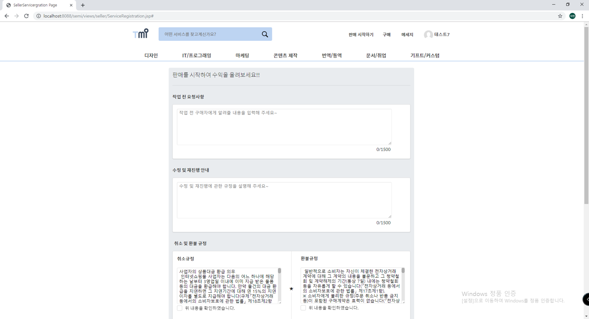
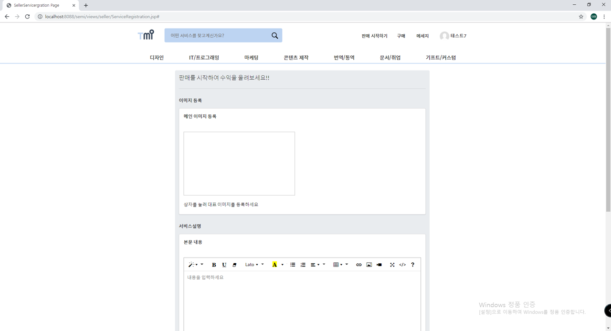
### 판매 관리
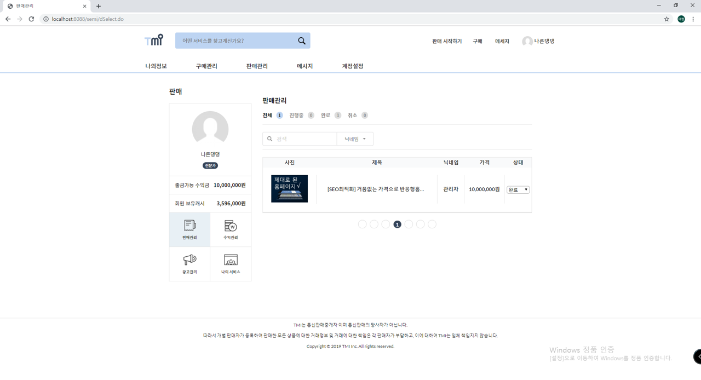
### 수익 관리
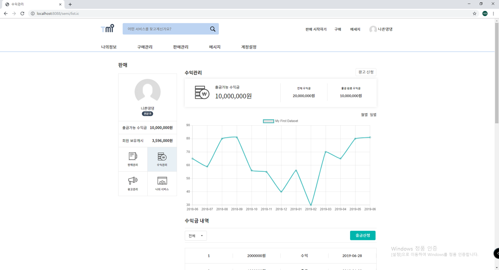
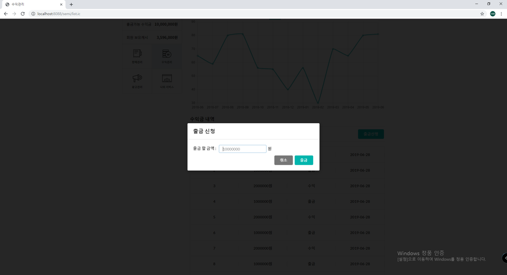
### 서비스 관리
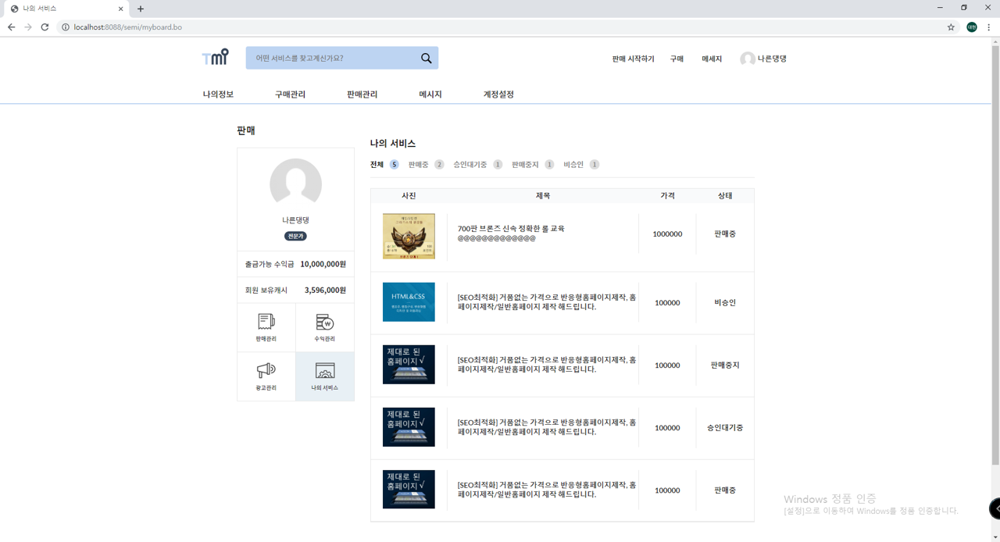
* * *
## 관리자
### 회원 관리
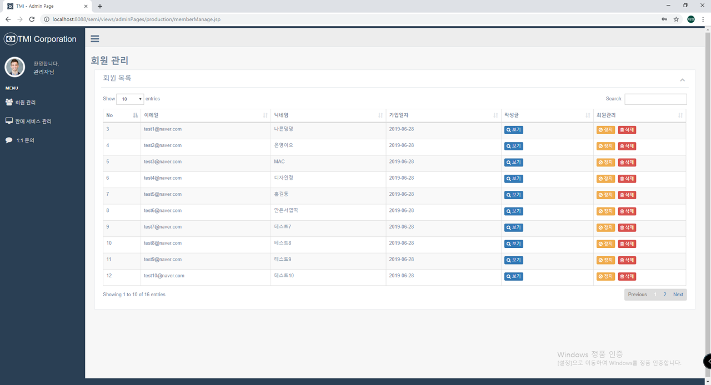
### 서비스 관리
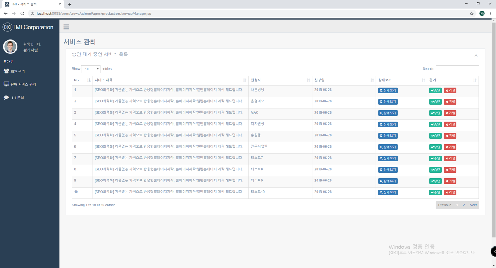
### 1:1 문의 관리

